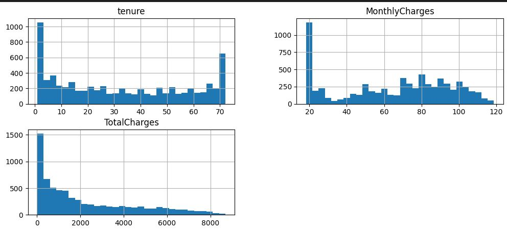
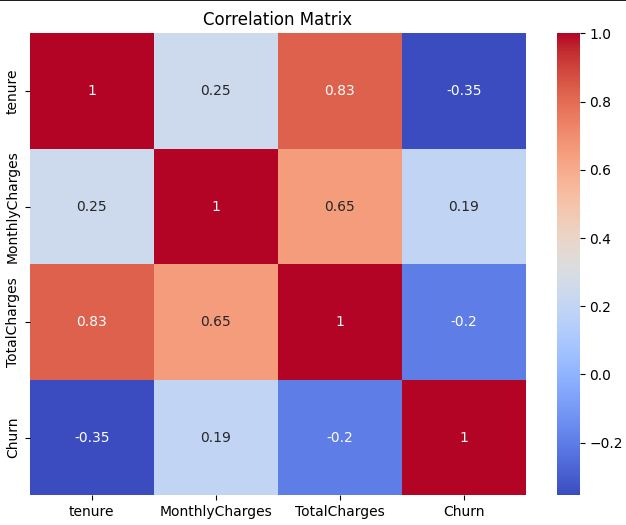
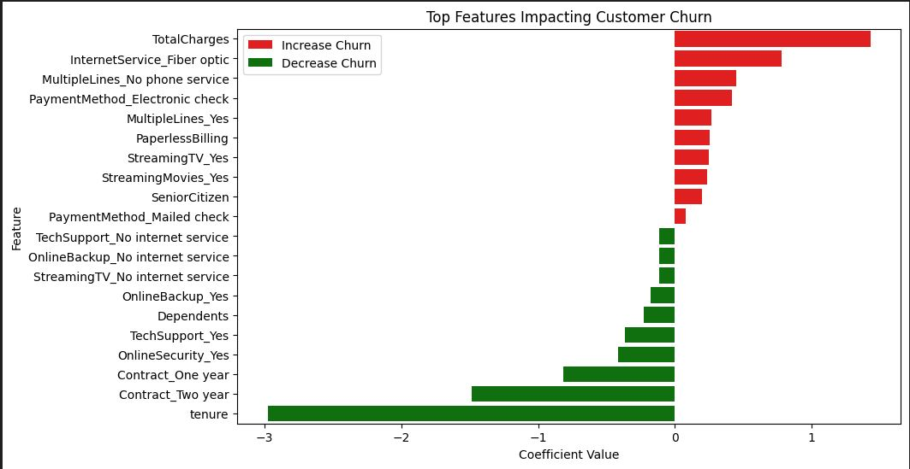
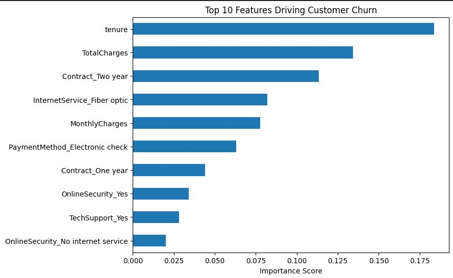
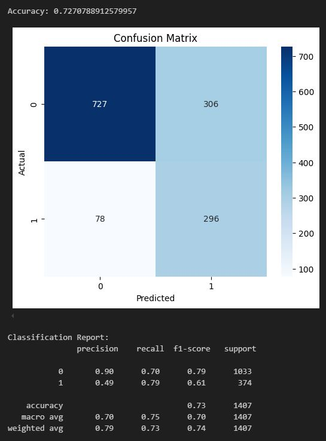
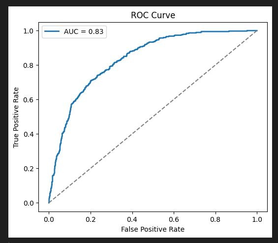
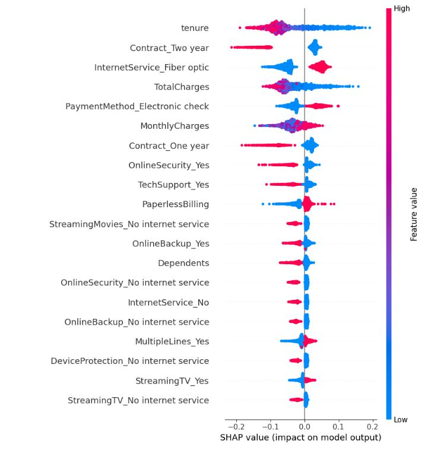

# 📊 Customer Churn Prediction Analysis


**Project Overview:**  
This project analyzes customer churn for a telecommunications company. The goal is to **identify key factors driving churn**, build predictive models, and provide actionable recommendations.

---

# 🚀 Customer Churn Prediction Project

---

## 🔗 Connect with Me

**🌟 Explore My Work:** [Portfolio Website](https://your-portfolio-link.com)  
**💼 Professional Profile:** [LinkedIn](https://linkedin.com/in/yourprofile)  

> ⚡ **Don't miss this!** Check out my portfolio to see other projects and innovations in Data Science & AI.

---


## 🔹 Table of Contents

- [1. Problem Statement](#1-problem-statement)  
- [2. Data Overview](#2-data-overview)  
- [3. Exploratory Data Analysis (EDA)](#3-exploratory-data-analysis-eda)  
- [4. Modeling Approach](#4-modeling-approach)  
- [5. Model Evaluation](#5-model-evaluation)  
- [6. Feature Importance & Insights](#6-feature-importance--insights)  
- [7. Actionable Recommendations](#7-actionable-recommendations)  
- [8. How to Use This Project](#8-how-to-use-this-project)  
- [9. Appendix](#9-appendix)

---

## 1️⃣ Problem Statement

Customer churn occurs when a customer stops doing business with a company. Predicting churn allows the company to:  

- Proactively **retain high-risk customers**  
- Optimize **marketing and retention strategies**  
- Increase **revenue and customer lifetime value (CLV)**  

**Objective:** Build a predictive model that identifies customers most likely to churn and extract actionable business insights.

---

## 2️⃣ Data Overview

**Dataset:** Telecommunications customer data including demographics, account info, and usage patterns.  

| Feature Category          | Example Columns |
|----------------------------|----------------|
| Customer Demographics      | `gender`, `SeniorCitizen`, `Partner`, `Dependents` |
| Account Information        | `tenure`, `Contract`, `PaymentMethod`, `MonthlyCharges`, `TotalCharges` |
| Services                  | `PhoneService`, `InternetService`, `OnlineSecurity`, `StreamingTV` |
| Target                     | `Churn` (Yes/No) |

**Dataset Stats:**  

- Total records: 5,000+  
- Target variable distribution: ~73% retained, 27% churned  
- Key challenges: missing values, infinite values in `TotalCharges`, categorical encoding required  

---

## 3️⃣ Exploratory Data Analysis (EDA)

### 🔹 Missing and Infinite Values
- `TotalCharges` contained missing and infinite values, which were imputed with the **median**.  

### 🔹 Target Variable Distribution

```text
0 (Retained): 1033
1 (Churned): 374
```
### 🔹 Key Insights from EDA

- **Tenure**: Shorter-tenure customers are most likely to churn.  
- **Contract type**: Month-to-month contracts have higher churn rates.  
- **Monthly Charges**: Higher monthly charges correlate with higher churn.  
- **Services**: Lack of value-added services (`OnlineSecurity`, `TechSupport`, `PhoneService`, `InternetService`) increases churn risk.  


<summary>Visualizations</summary>

- **Histogram plots** for numerical variables  
- **Bar plots** for categorical variables  
- **Correlation heatmap**  

<table>
  <tr>
    <td>
      
      <p><em> Numeric Features Distribution </em></p>
    </td>
    <td>
      
      <p><em>Correlation Heatmap matrix Between Tenure, MonthlyChrgs, Churn </em></p>
    </td>
  </tr>
</table>

 <table>
  <tr>
    <td>
      
      <p><em> Top Features Impacting Customer Churn </em></p>
    </td>
    <td>
      
      <p><em> Top 10 Features Driving  Churn </em></p>
    </td>
  </tr>
</table>


---


## 4️⃣ Modeling Approach

**Models Used:**

1. **Logistic Regression** (baseline model)  
2. **Random Forest Classifier** (optimized model)  

**Preprocessing Steps:**

- Categorical variables: One-hot encoding  
- Continuous variables: Standard scaling (`MonthlyCharges`, `TotalCharges`, `tenure`, `avg_charge`)  
- Missing/infinite values handled by **median imputation**  
- Class imbalance handled with `class_weight='balanced'`  

**Hyperparameter Optimization:**  
RandomizedSearchCV for Random Forest

| Parameter          | Value |
|------------------|-------|
| n_estimators      | 200   |
| max_depth         | 15    |
| min_samples_split | 5     |
| max_features      | log2  |
| class_weight      | balanced |

---

## 5️⃣ Model Evaluation

### 🔹 Logistic Regression Performance

| Metric     | Value      |
|------------|-----------|
| Accuracy   | 75%       |
| Precision  | 0.51–0.90 |
| Recall     | 0.73–0.78 |
| F1-score   | 0.62–0.81 |

<table>
  <tr>
    <td>
      <strong>Confusion Matrix:</strong><br>
      
    </td>
    <td>
      <strong>ROC Curve:</strong><br>
      
    </td>
  </tr>
</table>

### 🔹 Random Forest Performance

| Metric     | Value      |
|-----------|-----------|
| Accuracy  | 78%       |
| Precision | 0.57–0.87 |
| Recall    | 0.65–0.83 |
| F1-score  | 0.61–0.85 |

**Confusion Matrix:**  


**ROC Curve:**  


**Observation:**  
Random Forest outperforms Logistic Regression with higher overall accuracy and more balanced performance across classes.

---

## 6️⃣ Feature Importance & Insights

### 🔹 SHAP Analysis

SHAP (SHapley Additive exPlanations) provides **global and local interpretability** for tree-based models.

**Top features influencing churn:**

| Rank | Feature                 | Impact on Churn |
|------|-------------------------|----------------|
| 1    | Tenure                  | Longer tenure reduces churn risk |
| 2    | Contract_Two year       | Two-year contracts reduce churn |
| 3    | MonthlyCharges          | Higher charges increase churn |
| 4    | OnlineSecurity_Yes      | Providing online security reduces churn |
| 5    | TechSupport_Yes         | Providing tech support reduces churn |

**SHAP Summary Plot:**  


---

## 7️⃣ Actionable Recommendations

1. **Retention Programs:** Target customers with short tenure and high monthly charges.  
2. **Upsell Contracts:** Encourage month-to-month customers to upgrade to 1-year or 2-year plans.  
3. **Service Enhancements:** Promote value-added services (`OnlineSecurity`, `TechSupport`, `Backup`).  
4. **Pricing Strategy:** Evaluate high monthly charges and offer bundle discounts.  
5. **Continuous Monitoring:** Build a dashboard to track churn probability and intervene proactively.

## 8️⃣ How to Use This Project

### Requirements:
- **Python:** 3.10+
- **Libraries:** `pandas`, `numpy`, `scikit-learn`, `matplotlib`, `seaborn`, `shap`

### Steps:

```bash
git clone <repo-url>
cd churn-prediction
pip install -r requirements.txt
jupyter notebook
```

### How to Use This Project

1. **Run notebook cells sequentially:**
   - Data preprocessing
   - Exploratory Data Analysis (EDA)
   - Model training
   - Evaluation
   - SHAP analysis

2. **Charts and plots** are saved in the `/images` folder for reference or presentation.

---

## Appendix

- **Data Source:** Internal telecommunications dataset
- **Modeling Tools:** `scikit-learn`, `SHAP`

### Limitations

- Limited historical data; real-time prediction may vary
- Model interpretability requires domain expertise for actionable interventions

---

### Key Takeaways

- **Random Forest** is the best-performing model with **78% accuracy**.
- **Tenure, Contract Type, and Monthly Charges** are the strongest churn drivers.
- **SHAP analysis** provides a clear ranking of features for business decisions.
- Insights can directly inform **customer retention strategies**.


